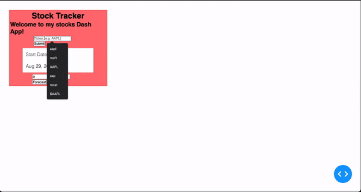

# Stock Analytics Application

Welcome to the Stock Analytics Application! This Python-based web app empowers users to track and forecast stock market trends with real-time data visualization and analysis. Simply enter a stock ticker, and the app will present you with a chart of historic stock prices along with valuable insights.

## Table of Contents

- [Overview](#overview)
- [Features](#features)
## Overview

The Stock Analytics Application is built using Python's Dash framework and Plotly library, offering an intuitive web interface for users to analyze stock market data. With this app, you can enter a stock ticker and instantly visualize the historical stock price trends on an interactive chart. Additionally, the application leverages machine learning techniques to predict potential stock price movements based on historical data.

## Features

- Dynamic real-time charting of historic stock prices.
- Integration with the yfinance library to fetch financial data for various companies.
- Company logo fetching through Clearbit's API based on domain inputs.
- Utilization of scikit-learn's linear regression algorithm for stock price movement prediction.